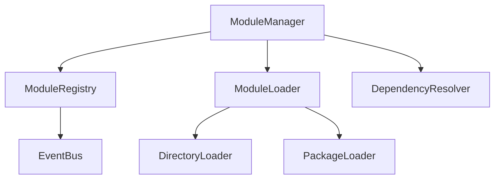
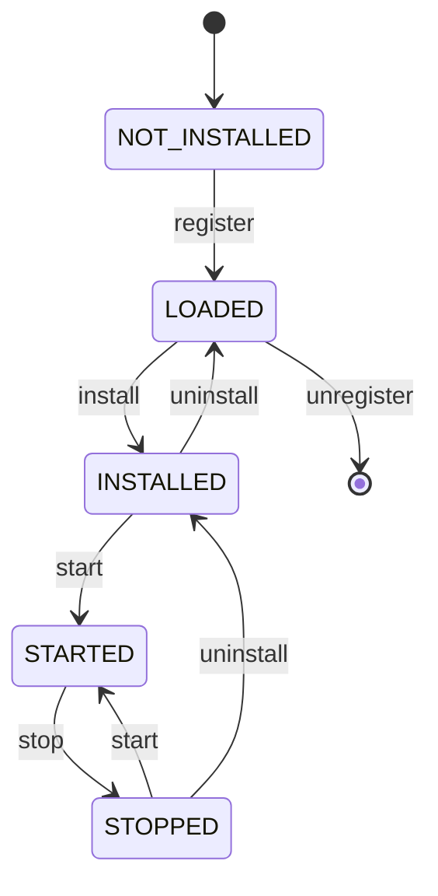

# Symphra Modules

[](https://www.python.org/downloads/)
[](https://opensource.org/licenses/MIT)
[](./development.md)

Symphra Modules is a high-performance, high-quality Python module management library designed for Python 3.11+.

## Core Features

### 🚀 High Performance Design

- **Intelligent Caching**: Module loading results cached to avoid redundant parsing
- **Memory Optimization**: Using `__slots__` to reduce memory footprint
- **Async Support**: Native support for both sync and async modules with automatic detection
- **Lazy Loading**: Load modules on demand to reduce startup time

### 📦 Flexible Loading Options

- **Directory Loading**: Automatically discover and load modules from specified directories
- **Package Loading**: Import modules from Python packages
- **Auto Loading**: Intelligently detect source type and choose loading strategy

### 🔄 Complete Lifecycle Management

- **State Machine**: Clear module state transitions
- **Lifecycle Hooks**: bootstrap → install → start → stop → uninstall
- **Hot Reload**: Support runtime module reloading

### 🔗 Smart Dependency Resolution

- **Topological Sort**: Dependency order resolution based on Kahn's algorithm
- **Cycle Detection**: Automatically detect and report circular dependencies
- **Missing Detection**: Verify all dependencies are satisfied

### 📡 Event-Driven Architecture

- **Pub/Sub**: Flexible event bus system
- **Wildcard Subscription**: Support `*` to listen to all events
- **Exception Isolation**: Single handler exception won't affect other handlers

### 🛡️ Type Safety

- **Strict Type Checking**: Validated with mypy strict mode
- **Protocol Support**: Use Protocol to define clear interface contracts
- **Runtime Checks**: `@runtime_checkable` ensures type safety

## Quick Start

### Installation

```bash
# Using uv (recommended)
uv add symphra-modules

# Using pip
pip install symphra-modules
```

### Basic Usage

```python
from symphra_modules import ModuleManager
from symphra_modules.abc import BaseModule, ModuleMetadata

# Define a module
class MyModule(BaseModule):
    @property
    def metadata(self) -> ModuleMetadata:
        return ModuleMetadata(
            name="my_module",
            version="1.0.0",
            dependencies=["other_module"]
        )

    def start(self) -> None:
        print("Module started!")

    def stop(self) -> None:
        print("Module stopped!")

# Use the manager
manager = ModuleManager()

# Load and start module
manager.load_module("my_module", source="./modules")
manager.start_module("my_module")

# Stop module
manager.stop_module("my_module")
```

### Async Module Example

```python
import asyncio
from symphra_modules.abc import BaseModule, ModuleMetadata

class AsyncModule(BaseModule):
    @property
    def metadata(self) -> ModuleMetadata:
        return ModuleMetadata(name="async_module")

    async def start(self) -> None:
        await asyncio.sleep(0.1)
        print("Async module started!")

    async def stop(self) -> None:
        await asyncio.sleep(0.1)
        print("Async module stopped!")
```

### Dependency Management Example

```python
from symphra_modules.resolver import DependencyResolver
from symphra_modules.config import ModuleMetadata

resolver = DependencyResolver()

# Add module metadata
resolver.add_module(ModuleMetadata(name="base"))
resolver.add_module(ModuleMetadata(name="auth", dependencies=["base"]))
resolver.add_module(ModuleMetadata(name="api", dependencies=["base", "auth"]))

# Get loading order
load_order = resolver.resolve()
print(load_order)  # ["base", "auth", "api"]
```

### Event System Example

```python
from symphra_modules.events import EventBus, ModuleStartedEvent

bus = EventBus()

# Subscribe to events
@bus.subscribe("module.started")
def on_module_started(event: ModuleStartedEvent) -> None:
    print(f"Module {event.module_name} started!")

# Publish events
bus.publish(ModuleStartedEvent("my_module"))
```

## Architecture Design

### Core Components



### State Transitions



## Performance Characteristics

- **Startup Time**: < 100ms (100 modules)
- **Memory Usage**: ~ 1MB (100 modules)
- **Loading Speed**: > 1000 modules/second
- **Concurrency**: Fully thread-safe

## Code Quality Assurance

- ✅ **Test Coverage**: 80%+
- ✅ **Type Checking**: mypy strict mode
- ✅ **Code Formatting**: ruff format
- ✅ **Code Linting**: ruff lint
- ✅ **Pre-commit Hooks**: Automated checks with pre-commit

## Next Steps

- [Quick Start](quickstart.md) - Detailed installation and usage guide
- [User Guide](guide/concepts.md) - Deep dive into core concepts
- [API Reference](api/abc.md) - Complete API documentation
- [Examples](examples.md) - More practical examples

## License

This project is licensed under the MIT License - see the [LICENSE](https://opensource.org/licenses/MIT) file for details.
