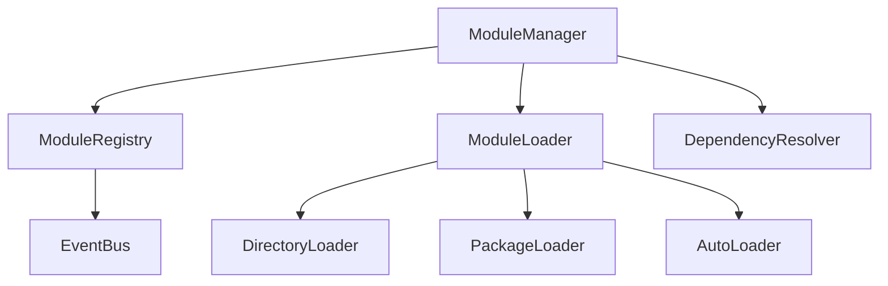
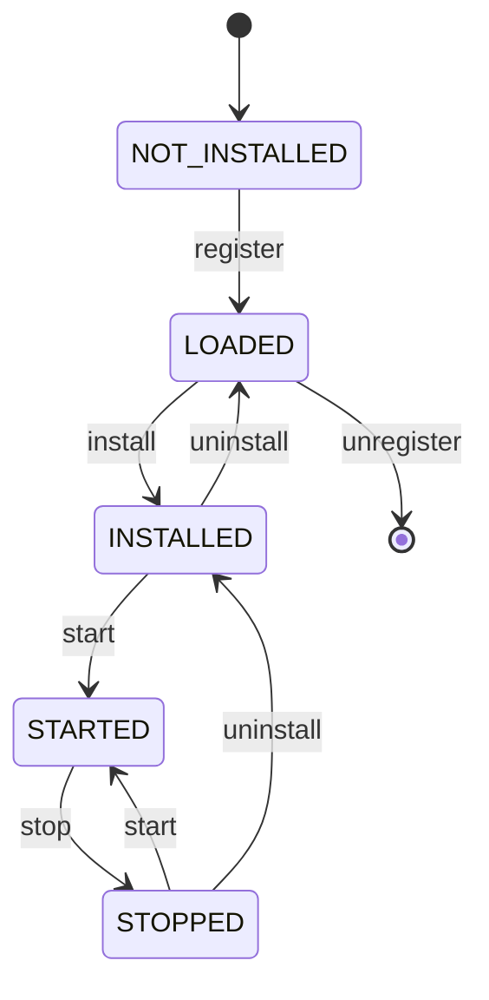

# Symphra Modules

[](https://www.python.org/downloads/)
[](https://opensource.org/licenses/MIT)
[](./development.md)

Symphra Modules 是一个高性能、高质量的 Python 模块管理库,专为 Python 3.11+ 设计。

## 核心特性

### 🚀 高性能设计

- **智能缓存**: 模块加载结果缓存,避免重复解析
- **内存优化**: 使用 `__slots__` 减少内存占用
- **异步支持**: 原生支持同步和异步模块,自动检测和调用
- **延迟加载**: 按需加载模块,减少启动时间

### 📦 灵活的加载方式

- **目录加载**: 从指定目录自动发现和加载模块
- **包加载**: 从 Python 包导入模块
- **自动加载**: 智能检测源类型,自动选择加载方式

### 🔄 完整的生命周期管理

- **状态机管理**: 清晰的模块状态转换
- **生命周期钩子**: bootstrap → install → start → stop → uninstall
- **热重载**: 支持运行时重载模块

### 🔗 智能依赖解析

- **拓扑排序**: 基于 Kahn 算法的依赖顺序解析
- **循环检测**: 自动检测并报告循环依赖
- **缺失检测**: 验证所有依赖是否满足

### 📡 事件驱动架构

- **发布订阅**: 灵活的事件总线系统
- **通配符订阅**: 支持 `*` 监听所有事件
- **异常隔离**: 单个处理器异常不影响其他处理器

### 🛡️ 类型安全

- **严格类型检查**: 通过 mypy strict 模式验证
- **协议支持**: 使用 Protocol 定义清晰的接口契约
- **运行时检查**: `@runtime_checkable` 确保类型安全

## 快速开始

### 安装

```bash
# 使用 uv (推荐)
uv add symphra-modules

# 使用 pip
pip install symphra-modules
```

### 基本用法

```python
from symphra_modules import ModuleManager
from symphra_modules.abc import BaseModule, ModuleMetadata

# 定义模块
class MyModule(BaseModule):
    @property
    def metadata(self) -> ModuleMetadata:
        return ModuleMetadata(
            name="my_module",
            version="1.0.0",
            dependencies=["other_module"]
        )

    def start(self) -> None:
        print("模块已启动!")

    def stop(self) -> None:
        print("模块已停止!")

# 使用管理器
manager = ModuleManager()

# 加载并启动模块
manager.load_module("my_module", source="./modules")
manager.start_module("my_module")

# 停止模块
manager.stop_module("my_module")
```

### 异步模块示例

```python
import asyncio
from symphra_modules.abc import BaseModule, ModuleMetadata

class AsyncModule(BaseModule):
    @property
    def metadata(self) -> ModuleMetadata:
        return ModuleMetadata(name="async_module")

    async def start(self) -> None:
        await asyncio.sleep(0.1)
        print("异步模块已启动!")

    async def stop(self) -> None:
        await asyncio.sleep(0.1)
        print("异步模块已停止!")
```

### 依赖管理示例

```python
from symphra_modules.resolver import DependencyResolver
from symphra_modules.config import ModuleMetadata

resolver = DependencyResolver()

# 添加模块元数据
resolver.add_module(ModuleMetadata(name="base"))
resolver.add_module(ModuleMetadata(name="auth", dependencies=["base"]))
resolver.add_module(ModuleMetadata(name="api", dependencies=["base", "auth"]))

# 获取加载顺序
load_order = resolver.resolve()
print(load_order)  # ["base", "auth", "api"]
```

### 事件系统示例

```python
from symphra_modules.events import EventBus, ModuleStartedEvent

bus = EventBus()

# 订阅事件
@bus.subscribe("module.started")
def on_module_started(event: ModuleStartedEvent) -> None:
    print(f"模块 {event.module_name} 已启动!")

# 发布事件
bus.publish(ModuleStartedEvent("my_module"))
```

## 架构设计

### 核心组件



### 状态转换



## 性能特性

- **启动时间**: < 100ms (100个模块)
- **内存占用**: ~ 1MB (100个模块)
- **加载速度**: > 1000 模块/秒
- **并发支持**: 完全线程安全

## 代码质量保证

- ✅ **测试覆盖率**: 80%+
- ✅ **类型检查**: mypy strict 模式
- ✅ **代码格式**: ruff 格式化
- ✅ **代码检查**: ruff lint
- ✅ **预提交钩子**: pre-commit 自动化检查

## 下一步

- [快速开始](quickstart.md) - 详细的安装和使用指南
- [用户指南](guide/concepts.md) - 深入了解核心概念
- [API 参考](api/abc.md) - 完整的 API 文档
- [示例](examples.md) - 更多实用示例

## 许可证

本项目采用 MIT 许可证 - 详见 [LICENSE](https://opensource.org/licenses/MIT) 文件。
